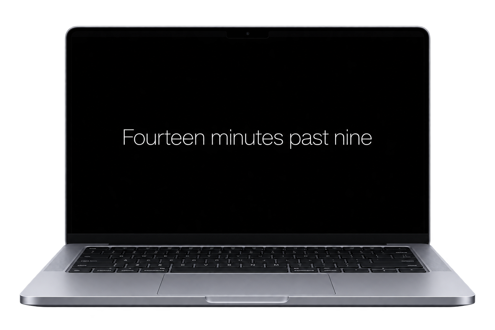

[](icon.png)

# Wordclock

A macOS screen saver that tells the time in words — not `21:14`, but “Fourteen minutes past nine”.

[](https://www.apple.com/macos/)
[](https://swift.org)
[](https://developer.apple.com/xcode/swiftui/)
[](#architecture)
[](LICENSE)

Every minute of the day has its own set of phrasings, up to eleven of them, stored in
`English.json` and `Russia.json`. The saver picks one per minute and crossfades to the next.

## Options

| Setting | What it does |
| -------------------- | ----------------------------------------------------------------- |
| **Language** | Russian or English phrasings |
| **Vary the wording** | A different phrasing every minute instead of always the first one |
| **Shift the text** | Slowly drifts the text across the screen to spare the display |
| **Text size** | Scales the type from 0.5× to 1.6× |

## Install

1. Open `WordclockScreenSaver.xcodeproj` in Xcode and build it (⌘B).
2. `Products → WordclockScreenSaver.saver → Show in Finder`, then double-click it or
   copy it into `~/Library/Screen Savers/`.
3. `System Settings → Screen Saver → Wordclock`, the **Options** button opens the table above.

After a rebuild copy the saver again and restart System Settings — `legacyScreenSaver`
caches the bundle, `killall legacyScreenSaver` helps.

## Architecture

```
WordclockScreenSaverView.swift   ScreenSaverView: hosts SwiftUI, owns the configure sheet
ClockEngine.swift                half-second tick, phrase for the current minute, drift
ClockLibrary.swift               JSON parsing: value_1…value_N → array of options
ClockScreen.swift                full-screen text layout
ConfigureView.swift              settings window
Settings.swift                   settings in ScreenSaverDefaults
```

Around 340 lines of Swift and two JSON files, no dependencies. The engine holds no view
and the view holds no clock: `ClockEngine` publishes a phrase and an offset,
`ClockScreen` draws them.

## Decisions worth explaining

**Resources load through `Bundle(for:)`, not `Bundle.main`.** Since macOS 14 a saver runs
inside `legacyScreenSaver`, and `Bundle.main` is that process — the JSON would not be found.

**The time key is built with `en_US_POSIX` and `HH:mm`.** On a 12-hour system a default
`DateFormatter` yields `09:41 AM`, and no key in the JSON would ever match.

**The phrasing is derived from the minute number, not drawn at random.** Every display
shows the same wording at the same time, and a re-tick inside the minute never swaps the
text mid-sentence.

**`value_1…value_N` is decoded with a dynamic coding key.** The number of options varies
from minute to minute; a fixed `CodingKeys` set would be as wide as the widest entry and
optional almost everywhere.

Notes in Russian on the file layout and the macOS 14 pitfalls are in
[`WordclockScreenSaver/README.md`](WordclockScreenSaver/README.md).

## About the idea

Made after the **Verbarius** clock designed at
[Art. Lebedev Studio](https://www.artlebedev.ru) — an amateur implementation of the idea
itself, written from scratch and not used commercially. The project is not affiliated
with the studio and is not their product; the name, the original design and its firmware
belong to them. If you are a rights holder and believe anything here infringes on your
rights, get in touch and it will be removed.

## License

MIT — take it and use it. See [LICENSE](LICENSE).
